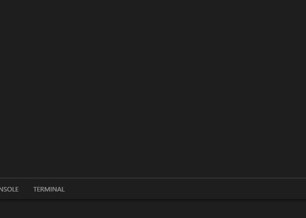
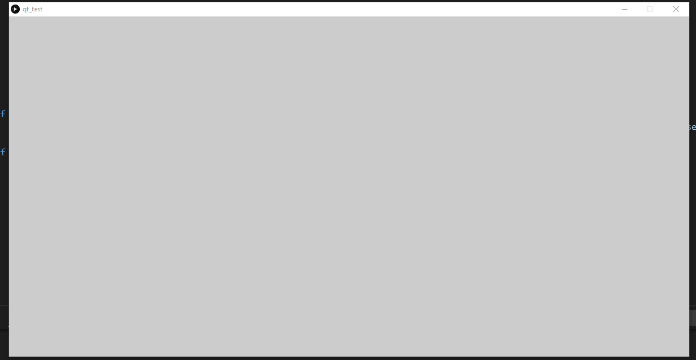

# collision_rps

Aim is to create a Rock Paper Scissor game with multiple blobs in a gui thing which uses collision.

The current version for the RPS as shown below uses n^2 algo for collision detection. The RPS is shown as below

Although QuadTrees has been implemented as shown below for collision detection, it still has to be checked whether it is correct or not and then need to be implemented into the game.

